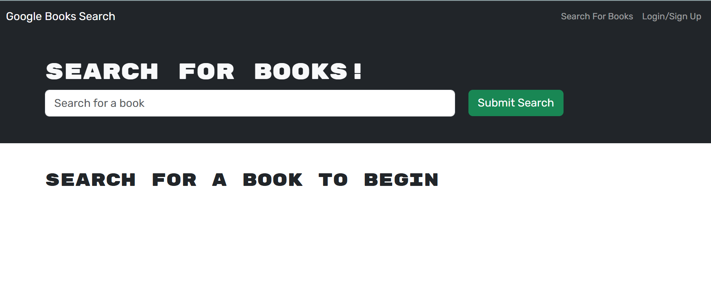
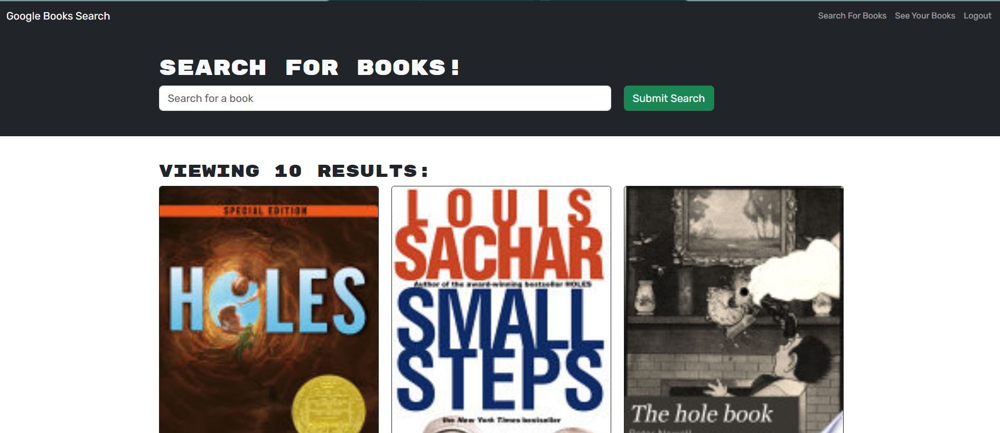
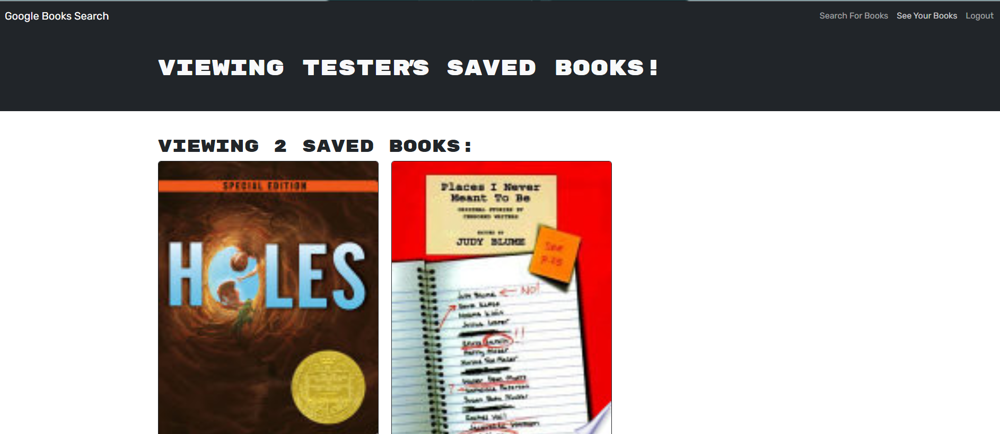

# 📚 Book Search Engine

A full-stack web application that allows users to search for books, view results from the Google Books API, and save their favorites. Built with **React**, **Apollo GraphQL**, **TypeScript**, **Express**, and **MongoDB**. Includes secure **JWT-based authentication** and supports responsive design for modern web use.

---

## 🌐 Live Demo

> 🔗 [Live on Render](https://book-search-engine-lx96.onrender.com/)

---

## 📸 Screenshots

### 🏠 Home Page


### 🔍 Book Search


### ❤️ Saved Books



## ✨ Features

- 🔍 Search for books via the **Google Books API**
- ❤️ Save books to a personal list
- 🧠 Built with **GraphQL** using Apollo Client & Server
- 🔐 **JWT authentication** to manage user sessions
- 📚 Stores saved books in a **MongoDB database**
- ⚡ Powered by **TypeScript** and **Mongoose**

---

## 🧱 Tech Stack

| Frontend  | Backend       | Database | Auth  |
|-----------|---------------|----------|-------|
| React     | Express.js    | MongoDB  | JWT   |
| Apollo Client | Apollo Server | Mongoose | bcrypt |
| TypeScript | TypeScript | GraphQL | dotenv |

---

## 📁 Project Structure

```
root/
├── client/              # React frontend (book search, login, save)
│   ├── src/
│   └── dist/            # Production build
│
├── server/              # GraphQL backend
│   ├── config/          # DB connection
│   ├── schemas/         # GraphQL schema + resolvers
│   ├── services/        # Auth and helpers
│   └── src/             # Entry point (server.ts)
│
├── package.json         # Root or separate for client/server
├── .env                 # Env variables (Mongo URI, JWT secret)
```

---

## 🚀 Getting Started

### 1. Clone the repository

```bash
git clone https://github.com/your-username/book-search-engine.git
cd book-search-engine
```

### 2. Install dependencies

Install client and server packages:

```bash
cd client && npm install
cd ../server && npm install
```

### 3. Set up your environment variables

Create a `.env` file in the `server/` folder:

```env
PORT=3001
MONGODB_URI=mongodb://localhost:27017/booksearch
JWT_SECRET_KEY=yourSuperSecret
NODE_ENV=development
```

### 4. Build and run

#### 🔧 Backend (GraphQL API)

```bash
cd server
npm run build
npm start
```

#### 💻 Frontend (React App)

```bash
cd client
npm run dev         # or npm start depending on setup
```

---

## 📬 API Endpoint

Once running, access GraphQL at:

```
http://localhost:3001/graphql
```

---

## 🔐 Authentication

Users must log in or sign up to save books. The client sends a JWT token with each request:

```
Authorization: Bearer <token>
```

---

## 🧪 Sample GraphQL Operations

**Save a book:**

```graphql
mutation {
  saveBook(bookData: {
    title: "The Hobbit",
    authors: ["J.R.R. Tolkien"],
    description: "A fantasy novel...",
    bookId: "1234"
  }) {
    username
    savedBooks {
      title
      authors
    }
  }
}
```

**Get current user:**

```graphql
query {
  me {
    _id
    email
    savedBooks {
      title
    }
  }
}
```

---

## ✍️ Author

> Corey  
> Full Stack Developer in Training  
> Bootcamp Project | Focused on TypeScript, GraphQL, and Modern Web Tools

---

## 🛡 License

This project is licensed under the **MIT License**.
